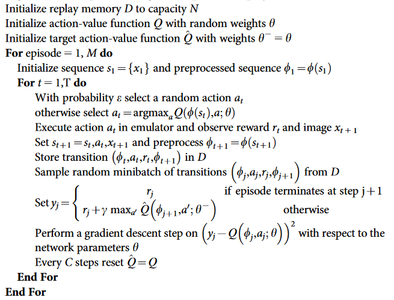
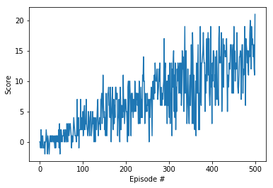

# Report for Deep Reinforcement Learning - Navigation Project

## Introduction

The goal is to collect as many yellow bananas as possible, while avoiding blue ones, in a closed square world:


A reward of +1 is provided for collecting a yellow banana, and a reward of -1 is provided for collecting a blue banana. Thus, the goal of your agent is to collect as many yellow bananas as possible while avoiding blue bananas.

The state space has 37 dimensions and contains the agent's velocity, along with ray-based perception of objects around the agent's forward direction. 

Given this information, the agent has to learn how to best select actions. Four discrete actions are available, corresponding to:

- 0 - move forward.
- 1 - move backward.
- 2 - turn left.
- 3 - turn right.

The task is episodic, and in order to solve the environment, the agent must get an average score of +13 over 100 consecutive episodes.

*source: https://github.com/udacity/deep-reinforcement-learning/blob/master/p1_navigation/README.md*

## Deep Q learning

### Definition

The deep Q learning is based on the Q learning technique, a reinforcement learning rational that learns the value of an action in a particular state.

> For any finite Markov decision process (FMDP), Q-learning finds an optimal policy in the sense of maximizing the expected value of the total reward over any and all successive steps, starting from the current state. Q-learning can identify an optimal action-selection policy for any given FMDP, given infinite exploration time and a partly-random policy. "Q" refers to the function that the algorithm computes – the expected rewards for an action taken in a given state.

*source: https://en.wikipedia.org/wiki/Q-learning*

The "deep" in deep Q learning refers to the method used to calculate the Q value: a deep neural network (instead of a Q table). The state of the environment is fed at each time step into the neural network, which will return the action to take.

To avoid instabilities due to the usage of neural network to predict actions values, two features are implemented:
- experience replay: a rolling history of past data via a re-play pool to average out previous states and avoid oscillations.
- fixed Q-targets: use a target network  to calculate the loss of every action during training. 

The Deep Q learning algorithm has been described in pseudo code in the research paper that introduces the Deep Q-Learning algorithm:



*source: https://storage.googleapis.com/deepmind-media/dqn/DQNNaturePaper.pdf*

### Implementation

The scripts used to define the deep Q neural network come from the lunar lander tutorial in the Deep Reinforcement Learning lesson from Udacity. In consists in three files:

- `dqn_agent.py`: Python script defining the agent class which learns and interacts with the environment and the replay buffer class to store experience tuples. The parameters (buffer size, batch size, discount factor, soft updating parameter, learning rate and network update frequency are let to their initial values from 'lunar lander' tutorial).
    - The dqn agent intitializes the local and target networks and several functions:
        - step: stores experience in the replay memory and learns every time steps by updating the target network with local network weights,
        - act: returns actions for given state as per current policy,
        - learn: updates value parameters using given batch of experience tuples, using soft_update function to update target network with local network weights with the interpolation parameter (Fixed Q target).
    - The replay buffer stores experience tuples with the functions:
        - add: to add a new experience into memory. Experience is defined by (state, action, reward, next_state, done)
        - sample: to randomly sample a batch of experiences from memory for the learning

- `model.py`: Python script which defines the Q network that will be trained to provide the action to take from a state. This neural network is composed of 3 layers:
    - The input layer which size correponds to dimension of each state.
    - Two hidden fully connected layers. The last one size corresponds to the dimension of each action.

- `Navigation.ipynb`: IPython notebook which imports the agent and perform the training in the Unity environment. The cells in this notebook allow to:
    - Import necessary librairies,
    - Examine the state and action spaces,
    - Take random actions in the environment,
    - Define and train the deep Q network

### Results

Parameters used in the agent training:

```python
BUFFER_SIZE = int(1e5)  # replay buffer size
BATCH_SIZE = 64         # minibatch size
GAMMA = 0.99            # discount factor
TAU = 1e-3              # for soft update of target parameters
LR = 5e-4               # learning rate 
UPDATE_EVERY = 4        # how often to update the network
```

The deep Q network has been trained using Udacity's workspace with GPU. The results of training are summarized belowed (from `Navigation.ipynb`):

| Episode         | Average score     |
|--------------|-----------|
| 100 | 0.95  | 
| 200 | 4.53  | 
| 300 | 7.36  | 
| 400 | 9.96  | 
| 500 | 12.90  | 
| 501 | 13.08  | 

Environment solved in 401 episodes!	Average Score: 13.08



These results meets the project's expectation as the agent is able to receive an average reward (over 100 episodes) of at least +13.

### Way forward

Some improvements can be made as suggested in the lessons associated by this project such as:
- Double dqn (to reduce overestimation of action values)
- Dueling dqn (to improve generalization and policy evaluation)

